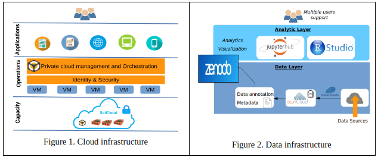

# Introduction
**SciCloud** is a private cloud platform that was created to support the scientific research in smart cities. This private cloud is to integrate infrastructure, platform and resources; and to provide a consolidated infrastructure for scientific experiments, software development and provision of analytics services. 

Figure 1 shows the cloud infrastructure, and Figure 2 shows the data architecture deployed on the cloud.

